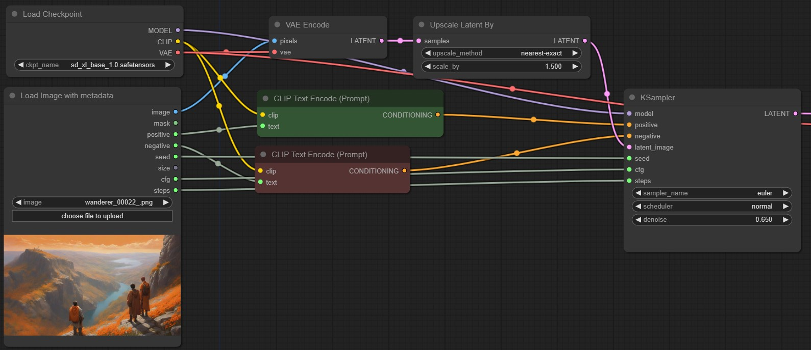

# Load Image with metadata

A custom node for comfy ui to read generation data from images (only png for now). 
This could be used for upscaling generated images, when the original prompts should be used.

The `Load Image with metadata` is thought as a replacement for the default `Load Image` node.

* positive prompt (STRING)
* negative prompt (STRING)
* seed (INT)
* size (STRING: eg. 512x512)
* cfg (FLOAT)
* steps (INT)

# Hot to use

Find the node via Search `LoadImageWithMetadata` or under `image/LoadImageWithMetadata` in the node dropdown.

# Credits

This is based on a core feature of https://github.com/receyuki/stable-diffusion-prompt-reader.